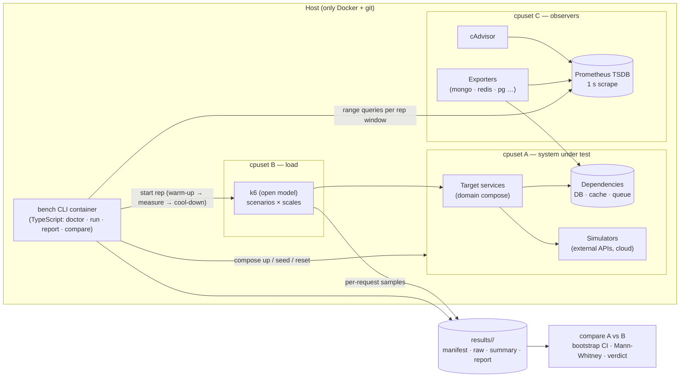

# Research — benchmark-kit-boilerplate (deliverable A)

Umbrella idea: `pixer-nest/.claude/tasks/baseline-performance-benchmark/01-idea.md` (section "A. dexter-bench-lab").

## Sources
- Umbrella `01-idea.md`, plus the user's statements in the session: scientific method, controlled variables, Docker required, machine-agnostic, metrics and methodology justified and system-independent, honest limits.
- User's memory rules: R-controlled-benchmark-experiments, R-generic-boilerplate-plus-skill, R-prefer-docker-isolation, R-typescript-for-domain-scripts, R-personal-repo-git-identity.
- Local host probe (2026-10-08, the user's machine):
  - 8 logical CPUs (4 cores × 2 threads), up to 4.7 GHz, 15 GiB RAM.
  - CPU governor `powersave`.
  - Node v22.17.0.
  - Docker 29.4.3 (apt, `docker-ce`), Compose v5.1.3, cgroup v2 (after the dev-environment fix, see Findings).
  - k6 is not installed (not needed: it runs as a container).
- Methodology references:
  - Kalibera & Jones, *Rigorous Benchmarking in Reasonable Time* (ISMM 2013), and *Quantifying Performance Changes with Effect Size Confidence Intervals* (tech report): repetitions, i.i.d. checks, CIs on effect size. [libkalibera notes](https://www.kvakil.me/posts/2022-04-01-using-libkalibera.html)
  - Brendan Gregg, USE method (Utilization, Saturation, Errors) for resources.
  - Tom Wilkie, RED method (Rate, Errors, Duration) for request-driven services.
  - Little's Law (L = λ·W) for queues.
  - Gil Tene, coordinated omission: an open-model load is required for honest latency percentiles. [k6 open vs closed model](https://grafana.com/docs/k6/latest/using-k6/scenarios/concepts/open-vs-closed/)
- Tool status (2026-10):
  - **k6** v2.3.0 is current (v2.0 released 2026-05-11, with breaking CLI/API cleanup). Image `grafana/k6`. [k6 v2 migration](https://grafana.com/docs/k6/v2.3.x/get-started/migrating-to-v2.md)
  - Its arrival-rate executors implement the open model and report `dropped_iterations`.
  - **cAdvisor** reads cgroup v1/v2 accounting and exposes CPU, memory, network, throttling. [Prometheus cAdvisor guide](https://prometheus.io/docs/guides/cadvisor/) It has known failures with some cgroup v2 / non-standard Docker data-root setups; the alternative is Telegraf's docker input. [Grafana dashboard 25012](https://grafana.com/grafana/dashboards/25012)
  - **percona/mongodb_exporter** v0.49.0 and **oliver006/redis_exporter** v1.89.0 are current and maintained. [redis_exporter releases](https://github.com/oliver006/redis_exporter/releases), [mongodb_exporter tags](https://hub.docker.com/r/percona/mongodb_exporter/tags)
  - **LocalStack:** since 2026-03-23 the image needs `LOCALSTACK_AUTH_TOKEN`, and the free Hobby plan is non-commercial only. That is unsuitable for company projects. Open alternatives: moto server (MIT), ElasticMQ (SQS), MinIO (S3), plus newer projects (MiniStack, Floci, kumo, fakecloud). [Testcontainers issue](https://github.com/testcontainers/testcontainers-java/issues/11568), [OSS alternatives comparison](https://codenote.net/en/posts/localstack-archived-oss-alternatives-comparison/), [moto/ElasticMQ overview](https://dev.to/umair24171/localstack-alternatives-what-works-after-account-lock-2e5e). This matters for C (pixer-nest), not for the kit core, but the kit's docs must not recommend LocalStack by default.

## Execution environment (decided by the user, 2026-10-08)
- Official benchmark runs happen on a **dedicated machine sized for the load** (enough CPU and RAM to hold the whole system under test, load generator and observers in Docker containers with isolation headroom). They do not run on a developer laptop.
- The **whole system under test runs in containers** on that host: app services, dependencies, simulators.
- A developer machine (like the user's 8-thread / 15 GiB laptop) is only for **authoring and smoke runs**: the kit self-test and tiny scales, to check that scenarios and the pipeline work. Its numbers are never baselines.
- Consequences for the kit:
  - `doctor` computes a **capacity plan**: required cores and RAM = sum of SUT limits + load-gen + observers + headroom. It classifies the host as `benchmark-grade` (all isolation and capacity checks pass) or `smoke-only`.
  - `run` marks results from a `smoke-only` host as non-baseline, and `compare` refuses them for verdicts.
  - The methodology documents a **host requirements** section: how to size the host from the target's limits, and the recommended host settings (`performance` governor, turbo off, swap off, no other workloads). For cloud hosts: dedicated/bare-metal or non-burstable instances, no T-class credits.
  - The cpuset split is computed from the actual host and the target's declared limits, not hard-coded. The earlier "4/2/2 on 8 threads" estimate applies only to this laptop's smoke runs.

## Requirements
- **Functional:**
  - F1. Methodology document in a generic layer only (no domain specifics):
    - principles;
    - a metric catalogue that gives each metric's purpose, source, aggregation and comparison rule;
    - the statistical treatment;
    - scale definition;
    - the reporting format;
    - limitations.
  - F2. Harness core that runs a **scenario × scale × repetition** matrix against a target:
    - pre-flight checks;
    - fresh state per repetition;
    - warm-up (discarded), measurement window, cool-down;
    - collection;
    - teardown.
  - F3. Pluggable collectors:
    - containers (CPU, memory, throttling, network, block I/O) for every service, not just the app;
    - optional exporters per dependency type (MongoDB, Redis/Valkey, PostgreSQL, …) enabled by the target config;
    - app-side metrics from the load generator.
  - F4. Open-model load generation (constant- and ramping-arrival-rate). Also a **capacity search** (step ramp to find the knee where the SLO breaks).
  - F5. Environment fingerprint and run manifest:
    - host CPU model/cores/governor, RAM, kernel, cgroup version, Docker/Compose versions;
    - image digests, target commit, kit version;
    - seed, load profile, limits, timestamps.
  - F6. Result storage per run (raw + summary), and a **compare** command:
    - deltas between two runs with bootstrap CI;
    - a significance test and effect size;
    - stability flags.
  - F7. Extension points for a domain: target compose, scenarios, seed/data generator, dependency simulators, collector selection, profile (scales, SLOs, repetitions).
  - F8. An example target that proves the kit end to end and measures its own noise floor.
- **Non-functional:**
  - Only Docker (+ git) on the host; the orchestrator itself runs in a container.
  - Reproducible: same inputs give results within the stated variance on the same host class.
  - The observer effect is minimized and *measured* (collector/load-gen CPU is recorded too).
  - No network calls leave the machine during a run (images are pulled beforehand).
  - TypeScript for the orchestrator/CLI (user preference for domain/ops scripts).
  - Minimal dependencies.
  - Honest: anything the kit can't guarantee on a given host is printed in the report, not hidden.

## Existing decisions (ADRs)
None. The repo is new and empty. Recommendation: start `docs/adr/` with the ADRs this phase produces (load generator choice, collector stack, statistics method, orchestrator-in-container), following `~/.claude/docs/adr-guidelines.md`.

## Data models / schemas
New, all versioned with a `schemaVersion` field:
- **`target.yaml`** (domain-provided):
  - `name`;
  - `compose` files;
  - `sut` services (names, cpu/mem limits);
  - `dependencies[]` with `type` (mongodb | redis | postgres | custom) → auto-enables the matching exporter;
  - `simulators[]`;
  - `healthchecks`;
  - `seed` command;
  - `reset` strategy (recreate volumes from a seeded snapshot).
- **`profile.yaml`** (domain-provided):
  - `scales` (small/medium/large as arrival rates, or multiples of a reference rate);
  - `scenarios[]` → k6 script + use-case tag;
  - `warmup`, `duration`, `cooldown`, `repetitions`;
  - `slo` (e.g. p99 < X ms, error rate < Y%) for capacity search;
  - `order` (sequential | interleaved).
- **`results/<run-id>/manifest.json`:** fingerprint (F5) + resolved config + kit version + status.
- **`results/<run-id>/raw/`:**
  - k6 per-request samples (CSV/JSON, gzipped);
  - a Prometheus TSDB snapshot or exported range queries (JSON) per repetition.
- **`results/<run-id>/summary.json`:** per scenario × scale × metric, the per-repetition values plus median, mean, stdev, CV, and 95% bootstrap CI.
- **`results/<run-id>/report.md`:** human-readable report with stability flags and printed limitations.
- **`comparisons/<a>__<b>.md|json`:** per metric, the ratio of medians with 95% bootstrap CI, the Mann-Whitney U p-value, and a verdict (improved / regressed / no significant change / inconclusive).

## Libs, tools, hooks, infrastructure
| Need | Existing (reuse) | Missing / to add |
|------|------------------|------------------|
| Container runtime | Docker 29.x + Compose v5.x on the dev laptop (fixed 2026-10-08) | Kit pre-flight enforces a minimum Docker/Compose version |
| Load generator | — | `grafana/k6` v2.x pinned by digest. Open model (arrival-rate executors) avoids coordinated omission; `dropped_iterations` signals load-gen saturation. Alternatives considered: Gatling (JVM, heavier), Locust (closed model by default, Python GIL limits), wrk2 (open model but HTTP-only, no scripting for multi-step flows). k6 wins on scripted multi-step flows + open model + small footprint |
| Container metrics | — | cAdvisor (pinned) scraped by Prometheus. Fallback when cAdvisor fails on the host's cgroup layout: a small built-in collector polling the Docker stats API (the orchestrator already has the socket) |
| Dependency metrics | — | Exporters enabled by `dependencies[].type`: `percona/mongodb_exporter` 0.49.x, `oliver006/redis_exporter` 1.89.x, `prometheuscommunity/postgres-exporter`. Custom types plug in their own exporter |
| Metric storage/query | — | Prometheus (pinned), 1 s scrape interval during runs, one fresh TSDB per run. The orchestrator pulls range queries per repetition window into `raw/`. Grafana is **optional** (a `--live` profile) and not needed for results |
| Orchestrator / CLI | Node 22 on host (not required) | TypeScript CLI in a `node:22-alpine`-based image, using the Docker socket. Commands: `doctor` (pre-flight + fingerprint), `run`, `report`, `compare`. Deps: `yaml`, a Docker client (`dockerode`) or shelling out to `docker compose`. Statistics (bootstrap, Mann-Whitney U) implemented in-house: ~100 lines, no heavy dependency |
| CPU isolation | — | Compose `cpuset` per group: SUT+deps / load generator / observers (Prometheus, exporters, cAdvisor). `doctor` computes the split from host cores and refuses or warns when there are too few cores to isolate |
| AWS simulation (domain-level) | — | Not in the core. The docs list moto server / ElasticMQ / MinIO as open options. LocalStack is noted as auth-token + non-commercial-free since 2026-03 |
| Example target | — | A minimal HTTP service + Redis + Postgres (or Mongo) with one write and one read flow. Used to validate the pipeline and measure the kit's noise floor (CV across repetitions) |

### Answers to the (A research) open questions
1. **Tooling:**
   - k6 (open model) for load;
   - cAdvisor + Prometheus + per-type exporters for collection;
   - JSON (machine-readable) + Markdown (human) for storage and reports;
   - a TypeScript orchestrator in a container.
   - Deltas: ratio of medians with a 95% percentile-bootstrap CI (10 000 resamples) and Mann-Whitney U (non-parametric; latency is not normal), following Kalibera & Jones's effect-size-CI approach.
2. **Variance and repetitions:**
   - Default **5 repetitions** per scenario × scale; the user can raise it.
   - Each metric's CV is reported: **≤ 5% = stable**, **5–10% = acceptable**, **> 10% = flagged unstable** (excluded from verdicts).
   - Comparisons run **interleaved** (A B A B …) so slow host drift hits both versions equally.
   - A comparison verdict needs a CI that excludes 1.0 **and** an effect above the kit's measured noise floor.
3. **Host limits:**
   - `doctor` records the fingerprint and runs pre-flight checks:
     - CPU governor (warn unless `performance`);
     - turbo/boost state;
     - swap use;
     - load average before the run (abort above a threshold);
     - free RAM vs the sum of limits;
     - cores vs the isolation plan;
     - cgroup version;
     - Docker/Compose versions.
   - Results from different **host classes** (CPU model + core count + governor) are never compared directly: `compare` refuses, or labels the result "cross-host, not comparable" when overridden.
   - Container limits (`cpus`, `mem_limit`) mirror prod task sizes, but the report states that a container CPU quota ≠ a cloud vCPU.
4. **Example target:** a tiny HTTP service with Redis + a DB, shipped in `examples/`. It doubles as the kit's self-test and noise-floor measurement.

## Test cases
| Scenario | Type | Derived from |
|----------|------|--------------|
| Bootstrap CI and Mann-Whitney U match reference values on known datasets (identical samples → CI contains 1.0 and p≈1; shifted samples → CI excludes 1.0) | unit | Success: delta with variance and confidence |
| Stability classifier: CV thresholds give stable/acceptable/unstable; unstable metrics are excluded from verdicts | unit | Failure: irreproducible results |
| `compare` refuses runs from different host classes unless overridden, and labels them when overridden | unit | Failure: overstated guarantees |
| Config validation: invalid `target.yaml`/`profile.yaml` fails with a clear message; dependency types map to the correct exporters | unit | Success: specialization without editing core |
| Pre-flight: too few cores for isolation, low RAM, non-`performance` governor and high load average each produce the expected warn/abort | unit (with an injected probe) | Success: honest limits |
| Capacity plan: target limits + kit overhead vs host resources classify the host as `benchmark-grade` or `smoke-only`; smoke-only results are marked non-baseline and rejected by `compare` verdicts | unit | Boundary: official runs only on a sized host |
| End-to-end on the example target: `doctor` → `run` (2 scales × 3 reps, short durations) → `report` produces the manifest, raw data for every service (including dependencies), the summary and the report | e2e (Docker) | Success: one command on a clean machine; metrics outside the app |
| Determinism: the same seed → identical dataset fingerprint (hash) between runs | e2e | Success: reproducible controlled variables |
| Noise floor: two runs of the same example version → `compare` says "no significant change" for all stable metrics | e2e | Success: variance within bound; no false positives |
| Sensitivity: an example variant with an injected delay or extra DB query → `compare` detects the regression with a CI that excludes 1.0 | e2e | Success: the kit can detect a real change |
| No egress during a run: run with the network restricted to the internal compose network (`internal: true`) | e2e | Failure: calls leaving the machine |

## Solution diagram


Proposed repo layout (to refine in Spec):
```
dexter-bench-lab/
  docs/methodology.md      # generic layer: principles, metric catalogue, stats, limits
  docs/adr/
  core/                    # orchestrator (TS), observer compose, collectors, stats
  templates/target/        # skeleton the skill (B) copies: target.yaml, profile.yaml, compose, scenarios/, seed/
  examples/hello-target/   # self-test + noise floor
  bench                    # thin wrapper: docker run … bench-cli
```

## Findings & risks
- **Dev environment (resolved 2026-10-08):** on the user's laptop, Docker was unreachable and a stale Compose v2.3.3 shadowed the system plugin. Fixed: user in the `docker` group, Compose v5.1.3, the duplicate snap Docker engine removed, `hello-world` OK. The laptop is ready for building and smoke-testing the kit.
- **Host noise:** the `powersave` governor and turbo boost are the largest variance sources on laptops. The kit can detect and warn but must not change host settings itself; the report prints them.
- **Observer effect:** Prometheus, cAdvisor and k6 share the machine. cpusets reduce interference but don't remove shared caches or memory bandwidth. Documented as a limitation. The dedicated benchmark host gives each group enough cores; the laptop is smoke-only.
- **Benchmark host availability:** which machine will be the benchmark host (on-prem box or cloud instance, its CPU/RAM) is not decided yet. It affects host-class labelling and the "large" scale ceiling. Needed by C at the latest, not by A.
- **Container ≠ cloud:** CPU quotas and a local disk don't reproduce ECS vCPU credits, EBS/network latency or managed-DB behaviour (e.g. Atlas/ElastiCache). Absolute numbers are **not** production predictions. The kit's claims are **relative** (A vs B on the same host class) plus local capacity knees. This must be the methodology's headline caveat.
- **No network latency by default:** containers talk over a bridge with ~0 latency. Optional per-link latency injection (`tc netem` via a sidecar, or a toxiproxy simulator) is an extension point, with a fixed value recorded in the manifest when used.
- **cAdvisor fragility:** it may fail on some cgroup v2 / rootless / non-standard data-root hosts. The fallback Docker-stats collector keeps the kit machine-agnostic.
- **macOS/Windows hosts:** Docker runs inside a VM, so limits and CPU accounting apply inside that VM. Supported with a printed caveat; host-class comparison already prevents mixing.
- **LocalStack licensing changed (2026-03):** relevant to C. Prefer moto server / ElasticMQ / MinIO there.
- **k6 v2 breaking changes:** pin the v2.x digest; scenarios must use v2 APIs.
- **Scope risk:** Grafana dashboards, distributed multi-host runs and CI integration are tempting. Keep them out of the MVP (an optional `--live` Grafana profile at most).

## Decisions taken (user, 2026-10-08)
- Official runs happen on a dedicated, sized benchmark host; the laptop is smoke-only (see "Execution environment").
- Statistics policy accepted as the default (configurable per target): 5 repetitions, CV ≤5% stable / 5–10% acceptable / >10% unstable, interleaved order, 95% bootstrap CI + Mann-Whitney U, verdict only above the measured noise floor.
- Grafana live view: **later**, not in the MVP.
- `.claude/tasks/` handoffs are **committed** in dexter-bench-lab.
- License: **MIT**.
- Remote `brunau1/dexter-bench-lab` exists (private, empty; `origin` verified).

## Still unknown
- Which machine will be the benchmark host (needed by C, not A).
